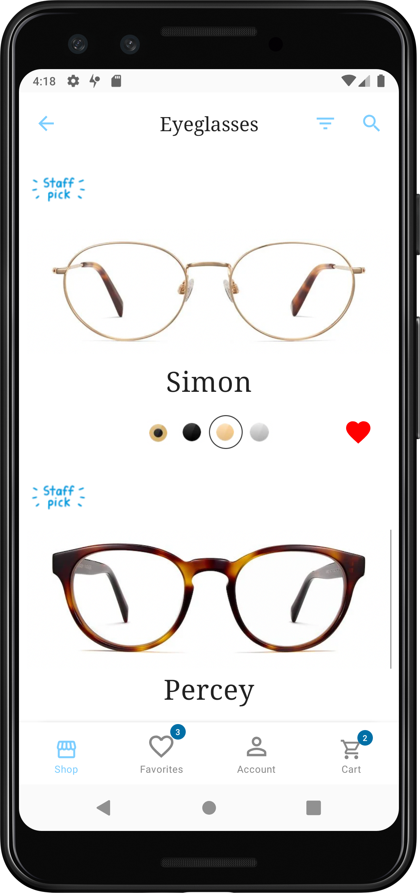
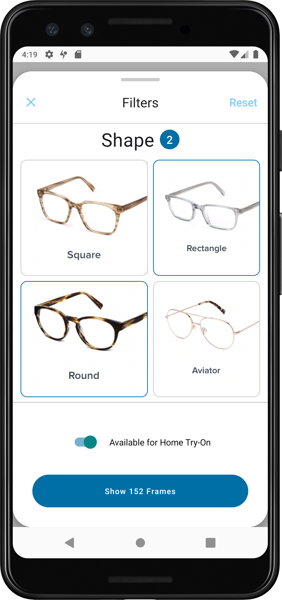
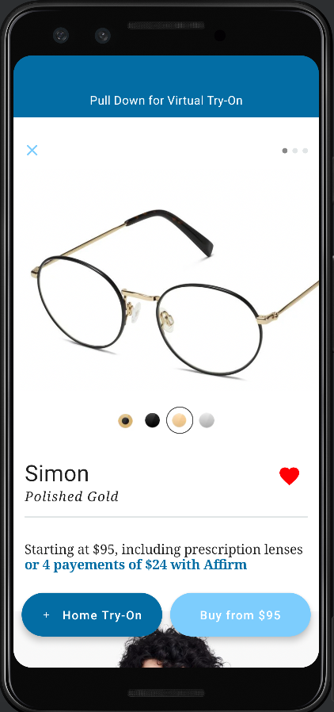
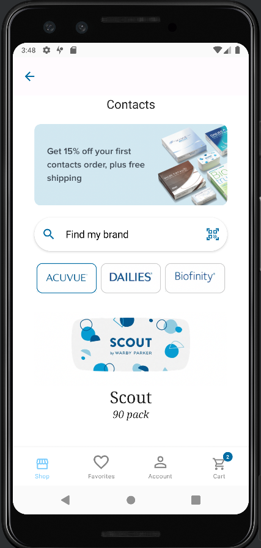
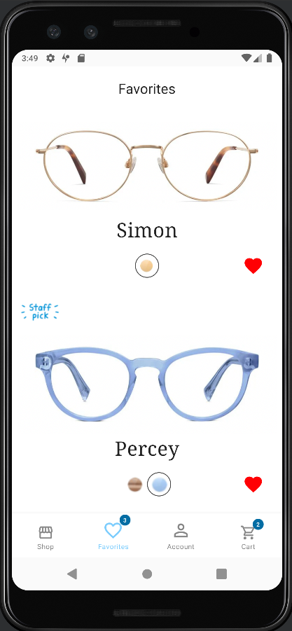
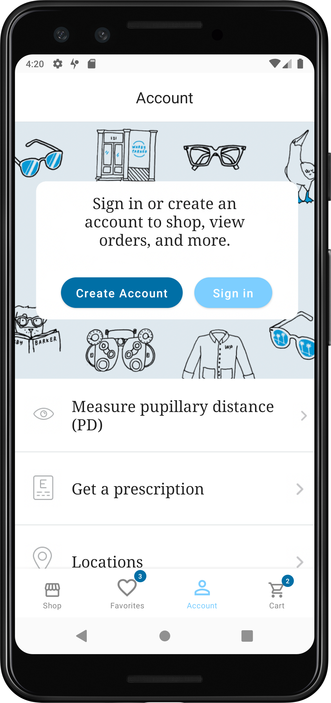
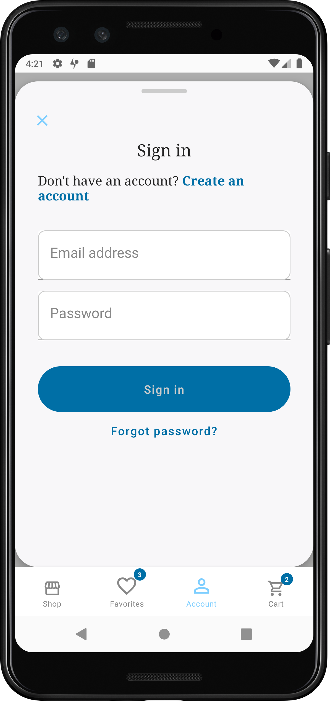
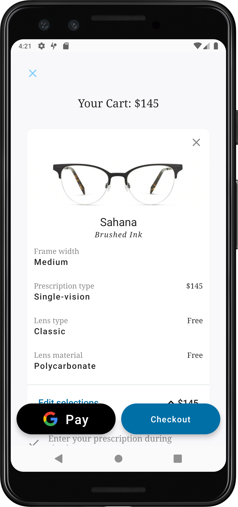
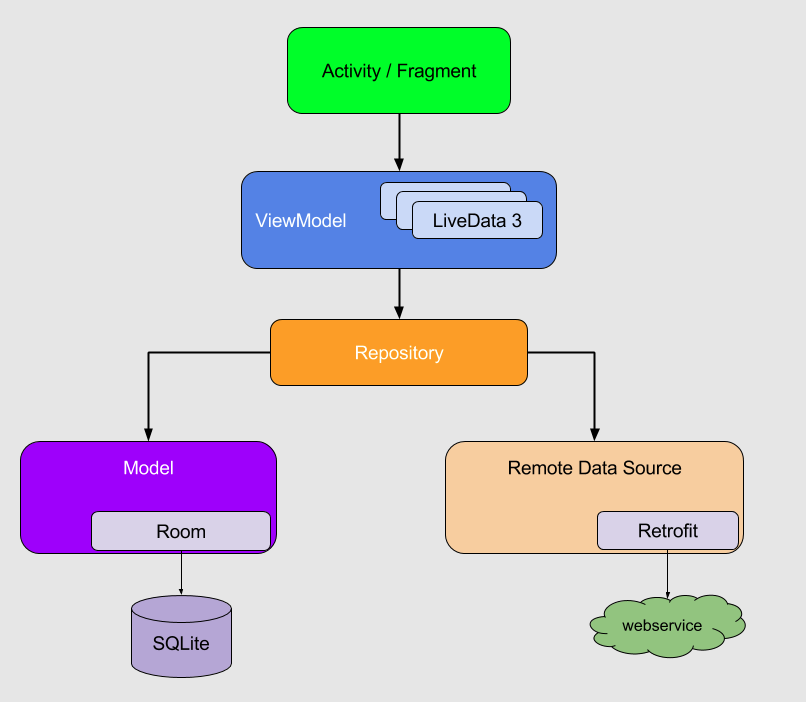

# Warby Parker - Android

A clone of Warby Parker app in Android built using Jetpack compose. 😎

🛑 **Disclaimer**: This project is solely for my own learning purposes, I do not intend to break any laws and privacy terms in regards to the actual Warby parker app or company. 🛑

This is a jetpack compose sample app written in Kotlin following clean architecture principles.

The purpose of this app to showcase:

- Clone the current iOS Warby Parker app for Android
- Implementation of Jetpack Android Architecture components with Dagger Android and Data Binding to minimize boilerplate code
- Creation of proper components and Subcomponents using Dagger Android and their injection into Activity, Compose Views, View Models and Helper Classes
- Performing background task with Kotlin Coroutines
- Use Jetpack compose Animations!
- Use CameraX and ARCore libraries to implement **face augmented reality**!

### Demo Screens

Home          | Eyeglasses     |  Filter |
:-------------------------:| :-------------------------:|:-------------------------: 
  |   |  

Details | Contacts             |  Favourites 
:-------------------------:|:-------------------------:|:-------------------------: 
 |   |   | /> 
 
Account  | Login             |  Cart | 
:-------------------------:|:-------------------------:|:-------------------------:
   |   |   |

Demo
:-------------------------:|
 |

## 🏗️️ Built with ❤️ using Jetpack Compose

| What            | How                        |
|----------------	|------------------------------	|
| 🎭 User Interface (Android)   | [Jetpack Compose](https://developer.android.com/jetpack/compose)                |
| 🏗 Architecture    | [MVVM](https://developer.android.com/topic/architecture#data-layer)                            |
| 💉 DI (Android)                | [Hilt](https://developer.android.com/training/dependency-injection/hilt-android)                        |
| 🌊 Async            | [Coroutines](https://kotlinlang.org/docs/coroutines-overview.html) + [Flow](https://kotlin.github.io/kotlinx.coroutines/kotlinx-coroutines-core/kotlinx.coroutines.flow/-flow/)                |
| 👨‍💻 Google SceneForm | [Sceneform](https://github.com/SceneView/sceneview-android)
| 🌐 Networking        | [Retrofit](https://square.github.io/retrofit/)                        |
| 📄 Parsing            | [KotlinX](https://kotlinlang.org/docs/serialization.html)                            |

## App Architecture

#### Separation of concerns
- Business logic should not be intertwined with the UI code
- UI-based classes should only contain logic that handles UI and operating system interactions

#### Drive UI from a model
- The (view) model is responsible for handling data for the UI
- The (view) model should not be affected by the app's lifecycle and configuration changes

#### Repository Pattern (https://martinfowler.com/eaaCatalog/repository.html)
- Repositories to be mediators between different data sources
-  A repository pattern approach will provide a clean API to retrieve data easily from single or multiple access points. (network, local storage, etc..)

## Languages, libraries and tools used

- [Kotlin](https://kotlinlang.org/)
- AndroidX libraries
- [Android Architecture Components](https://developer.android.com/topic/libraries/architecture)
- [Android Data Binding](https://developer.android.com/topic/libraries/data-binding)
- [Dagger 2](https://github.com/google/dagger)
- [Retrofit](http://square.github.io/retrofit/)
- [Kotlin Coroutines](https://developer.android.com/kotlin/coroutines)
